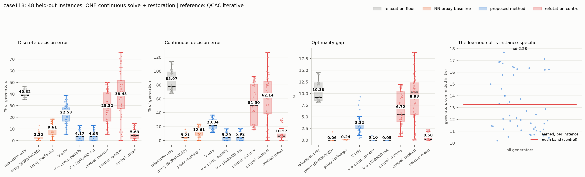
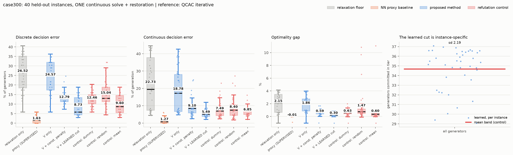

# Decision-Focused Surrogate Modeling for MINLP

A neural network predicts the **linearisation point** and a **cardinality cut** for
the QCAC relaxation of AC unit commitment, so that **one continuous solve plus
feasibility restoration** replaces the iterative QCAC method. Training is
self-supervised on the deployment cost — no optimal solutions are used as labels.

Case studies: IEEE **case118** (54 generators) and **case300** (69 generators).

## The method

```
(pd, qd) ──► network ──┬──► (Vre, Vim)      the linearisation point
                       └──► [n_lo, n_hi]    the cardinality cut

     ──► ONE continuous solve (QCAC linearised at the predicted point,
                              with n_lo ≤ Σu ≤ n_hi, NO binary variables)
     ──► fractional u
     ──► round ▸ reserve top-up ▸ upward repair ▸ downward repair
     ──► commitment + dispatch
```

**Why predict the linearisation point.** QCAC iterates in order to *find* it.
At the exact point, one solve plus rounding recovers the optimal commitment
(−0.002% gap, 100% agreement) — even with 40 of 54 generators still fractional.
Rounding is not the bottleneck; the linearisation point is.

**Why the cardinality cut.** The predicted point is never exact, and that error
is what costs money. The cut absorbs it: at ‖ΔV‖ = 0.76 it takes the gap from
5.78% to 1.90% and commitment agreement from 68.2% to 87.0%. It tolerates being
wrong by ±2 units, and beats a cut that reveals 8 correct generators.

The band is anchored on `n_min`, the fewest generators that can meet the reserve
(a sort and a cumulative sum — no solve, no labels, and a *valid* lower bound).
Measured over 112 instances, `n* − n_min ∈ [+6, +9]`, correlation 0.926.

## Results (held out)

Both cases run an **identical** configuration: K=1 cardinality cut imposed
hard, 45 epochs, full batch, the same restoration depth in training and
evaluation, the same learning rate, and a band initialisation derived from
`n_min` rather than chosen per case.

**case118** — 192 instances, 144 train / 48 held out:

| method | discrete | continuous | gap | labels |
|---|---|---|---|---|
| relaxation only (flat V, no cut) | 40.32% | 85.97% | +10.378% | – |
| NN proxy (supervised on u\*) | 3.32% | 5.21% | +0.057% | **yes** |
| NN proxy (self-supervised) | 9.61% | 12.61% | +0.242% | no |
| ours: V only | 22.53% | 23.34% | +3.319% | no |
| ours: V + constant penalty | 4.17% | 5.29% | +0.103% | no |
| **ours: V + LEARNED cardinality cut** | **4.05%** | 5.92% | **+0.049%** | no |
| *control:* dummy band | 28.32% | 51.50% | +6.718% | no |
| *control:* random band | 38.43% | 62.14% | +8.933% | no |
| *control:* mean band (no per-instance info) | 5.63% | 10.57% | +0.582% | no |

**case300** — 151 instances, 111 train / 40 held out:

| method | discrete | continuous | gap | labels |
|---|---|---|---|---|
| relaxation only | 26.52% | 22.73% | +2.154% | – |
| NN proxy (supervised on u\*) | 1.63% | 1.27% | −0.006% | **yes** |
| ours: V only | 24.57% | 18.78% | +1.861% | no |
| ours: V + constant penalty | 12.79% | 9.10% | +0.592% | no |
| **ours: V + LEARNED cardinality cut** | **8.73%** | **5.49%** | **+0.296%** | no |
| *control:* mean band | 9.60% | 6.85% | +0.605% | no |

*discrete* = % of generators committed wrongly. *continuous* =
‖pg − pg\*‖₁ / Σpg\*, on the recovered dispatch. *gap* = true AC cost against
the QCAC-iterative reference.




## What this does and does not show

* **The cut is learned, not a disguised constant.** Three controls exist to
  refute that: a dummy band (any always-violated value), a random band, and a
  mean band — the learned bounds averaged over the test set, carrying no
  per-instance information. All fail on both cases; the mean-band control, the
  sharpest, loses by 12x on case118 and 2.0x on case300. Learned bounds vary
  per instance with sd 2.28 and 2.19 generators; a constant band has spread 0.
* **Soft cuts are inert — this was a real bug, not a tuning issue.** With a
  linearly priced cut that binds, the penalty gradient is constant and the
  right-hand side drops out of the optimality conditions. A dummy band [0,0],
  and [0,0] shifted by −20, reproduced the learned band bit-for-bit. Cuts are
  imposed hard (`cut_cap=0`) with a softly priced fallback.
* **Three alternatives were measured and rejected, not tuned away.**
  *Tiering:* K=3 interleaved +0.351%, random partition +0.807%, contiguous
  merit blocks +1.757%, against K=1's +0.049%.
  *Learned rounding threshold* (L2O-MINLP): a per-instance threshold ties fixed
  0.5 exactly on case118; the learned head settled at 0.499–0.500 on both cases
  and scored identically to fixed rounding.
  *Confidence-based variable fixing:* helps only with a labelled 96.5%-accurate
  predictor; with the label-free one (9.6% error) discrete error worsens from
  4.17% to 7.68% and 7 of 48 instances become infeasible.
* **case118 is at its ceiling.** The oracle linearisation point, unbeatable by
  any method, scores −0.002% against this method's +0.049%.
* **case300 is data-limited, not method-limited.** Its V head predicts a
  600-dimensional correction from 111 instances and barely beats the baseline
  alone (+1.861% vs +2.154%). The supervised proxy reaches −0.006% there, at the
  price of one reference solve per training instance.
* **The reference is not a certified optimum.** QCAC iterative matches the global
  MINLP optimum where both were run, but this method beat it on 13 of 24
  instances in one experiment. Results are stated relative to it.
* Seed replication used re-splits of one instance pool — closer to
  cross-validation than to independent replication.

## A note on the solver

Gurobi solves the **continuous** QCAC relaxation — with no integer variables —
by spatial branch-and-bound, because it will not certify
`cij² + sij² ≤ cii_i·cii_j` as a rotated cone (8 of case118's 186 stay
bilinear). That takes 120 s and still hits the time limit. The same problem is
an SOCP: CLARABEL solves it in **0.077 s**, returning the same cost to the digit.
Gurobi is kept only where binaries genuinely exist — the global solver and the
QCAC-iterative reference.

The SOC constraint itself is load-bearing and must not be dropped for speed:
without it the slack still converges to 1e-10, but the solution leaves the
rank-1 manifold and case118 returns 161,352.6 against a proven optimum of
164,101.4 — a cost *below* the optimum, i.e. not physical.

## Layout

| path | |
|---|---|
| `src/acuc.py` | one model builder, two solvers (global spatial B&B, QCAC iterative), one verifier |
| `src/socp.py` | the QCAC relaxation as a parameterised SOCP (CLARABEL) |
| `src/pipeline.py` | grid, instance sampling, deployment, restoration, pool workers |
| `11_vcard.py` | the method: V head + cardinality-cut head, smoothed self-supervised training |
| `00_refs.py` | QCAC-iterative references, cached per seed |
| `02_ceiling.py` … `10_cardinality.py` | the diagnostics the design rests on |
| `15_proxy.py`, `16_proxy_self.py` | NN proxy baselines, supervised and self-supervised |
| `17_cut_ablation.py` | which cut rows matter, and sensitivity to band placement |
| `overnight.sh`, `run2.sh` | the experiment queues |

Instances are sampled with **one correlated system draw** per instance, not an
i.i.d. factor per load. The i.i.d. sampler produced under 1% aggregate demand
variation on case118 and 1–2 distinct optimal commitments out of 32, which makes
any comparison meaningless. The correlated draw gives ~10% variation and 16–25
distinct commitments.

## Reproducing

```bash
QCAC_CASE=case118 SEED=0 NINST=40 PROCS=12 python 00_refs.py      # references
QCAC_CASE=case118 python 11_vcard.py --arm vcard --epochs 40 \
    --procs 12 --down 6 --n-test 48 --tag c118                    # train
QCAC_CASE=case118 NTEST=48 python 14_errors.py                    # figures
```

Requires `gurobipy` (reference only), `cvxpy` + `clarabel`, `torch`, `pandapower`.
