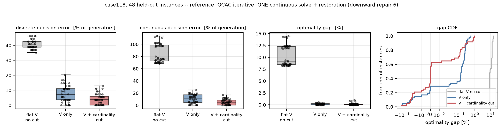
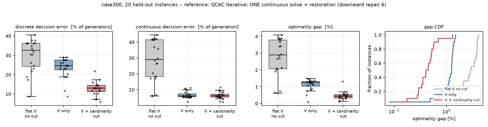

# Decision-Focused Surrogate Modeling for MINLP

A neural network predicts the **linearisation point** and a **cardinality cut** for
the QCAC relaxation of AC unit commitment, so that **one continuous solve plus
feasibility restoration** replaces the iterative QCAC method. Training is
self-supervised on the deployment cost — no optimal solutions are used as labels.

Case studies: IEEE **case118** (54 generators) and **case300** (69 generators).

## The method

```
(pd, qd) ──► network ──┬──► (Vre, Vim)      the linearisation point
                       └──► [n_lo, n_hi]    the cardinality cut

     ──► ONE continuous solve (QCAC linearised at the predicted point,
                              with n_lo ≤ Σu ≤ n_hi, NO binary variables)
     ──► fractional u
     ──► round ▸ reserve top-up ▸ upward repair ▸ downward repair
     ──► commitment + dispatch
```

**Why predict the linearisation point.** QCAC iterates in order to *find* it.
At the exact point, one solve plus rounding recovers the optimal commitment
(−0.002% gap, 100% agreement) — even with 40 of 54 generators still fractional.
Rounding is not the bottleneck; the linearisation point is.

**Why the cardinality cut.** The predicted point is never exact, and that error
is what costs money. The cut absorbs it: at ‖ΔV‖ = 0.76 it takes the gap from
5.78% to 1.90% and commitment agreement from 68.2% to 87.0%. It tolerates being
wrong by ±2 units, and beats a cut that reveals 8 correct generators.

The band is anchored on `n_min`, the fewest generators that can meet the reserve
(a sort and a cumulative sum — no solve, no labels, and a *valid* lower bound).
Measured over 112 instances, `n* − n_min ∈ [+6, +9]`, correlation 0.926.

## Results (held out)

**case118** — 192 instances, 144 train / 48 test:

| method | discrete error | continuous error | gap | labels |
|---|---|---|---|---|
| relaxation only (flat V, no cut) | 40.32% | 85.97% | +10.378% | – |
| NN proxy (supervised on u\*) | 3.24% | 5.49% | +0.063% | **yes** |
| ours: V only | 7.72% | 10.36% | +0.137% | no |
| **ours: V + cardinality cut** | **4.17%** | **5.29%** | **+0.103%** | no |

**case300** — 78 instances, 58 train / 20 test:

| method | discrete error | continuous error | gap | labels |
|---|---|---|---|---|
| relaxation only | 29.93% | 28.57% | +2.754% | – |
| NN proxy (supervised on u\*) | 1.30% | 1.34% | +0.385% | **yes** |
| ours: V only | 23.33% | 6.70% | +1.108% | no |
| **ours: V + cardinality cut** | **12.68%** | **6.32%** | **+0.454%** | no |

*discrete error* = % of generators committed wrongly.
*continuous error* = ‖pg − pg\*‖₁ / Σpg\*, on the recovered dispatch.
*gap* = true AC cost against the QCAC-iterative reference.




## What this does and does not show

* **The supervised NN proxy is currently the strongest arm on both cases.** It
  predicts the commitment directly and beats this method on gap and on discrete
  error. It is trained on reference commitments — one QCAC solve per training
  instance — which this method never uses. The defensible claim is therefore
  *comparable accuracy without labels*, not superiority. A self-supervised proxy
  (same signal as ours, no labels) is the comparison that decides whether the
  relaxation in the loop is load-bearing; it is not finished yet.
* **The cut's advantage shrinks as data grows.** With 88 training instances,
  V-only scored +2.360% and V+cut +0.182% (13×). With 144, the same arms score
  +0.137% and +0.103% (1.3×). Much of what the cut buys is compensating for a
  data-starved V head. It still clearly reduces *discrete* error.
* **case300 is data-starved**: 58 training instances for a 600-dimensional
  voltage target. That is the likeliest reason the V head trails the proxy there.
* **Free-form cuts do not work.** Learning 8×108 = 864 cut coefficients per
  instance loses to no cuts at all on every seed tested. The cardinality cut
  emits two numbers.
* **The reference is not a certified optimum.** QCAC iterative matches the global
  MINLP optimum where both were run, but this method beats it on 13 of 24
  instances in one experiment, so it is not optimal everywhere. Results are
  stated relative to it, not to a proven optimum.
* Seed replication used re-splits of one instance pool, which is closer to
  cross-validation than to independent replication.

## A note on the solver

Gurobi solves the **continuous** QCAC relaxation — with no integer variables —
by spatial branch-and-bound, because it will not certify
`cij² + sij² ≤ cii_i·cii_j` as a rotated cone (8 of case118's 186 stay
bilinear). That takes 120 s and still hits the time limit. The same problem is
an SOCP: CLARABEL solves it in **0.077 s**, returning the same cost to the digit.
Gurobi is kept only where binaries genuinely exist — the global solver and the
QCAC-iterative reference.

The SOC constraint itself is load-bearing and must not be dropped for speed:
without it the slack still converges to 1e-10, but the solution leaves the
rank-1 manifold and case118 returns 161,352.6 against a proven optimum of
164,101.4 — a cost *below* the optimum, i.e. not physical.

## Layout

| path | |
|---|---|
| `src/acuc.py` | one model builder, two solvers (global spatial B&B, QCAC iterative), one verifier |
| `src/socp.py` | the QCAC relaxation as a parameterised SOCP (CLARABEL) |
| `src/pipeline.py` | grid, instance sampling, deployment, restoration, pool workers |
| `11_vcard.py` | the method: V head + cardinality-cut head, smoothed self-supervised training |
| `00_refs.py` | QCAC-iterative references, cached per seed |
| `02_ceiling.py` … `10_cardinality.py` | the diagnostics the design rests on |
| `15_proxy.py`, `16_proxy_self.py` | NN proxy baselines, supervised and self-supervised |
| `17_cut_ablation.py` | which cut rows matter, and sensitivity to band placement |
| `overnight.sh`, `run2.sh` | the experiment queues |

Instances are sampled with **one correlated system draw** per instance, not an
i.i.d. factor per load. The i.i.d. sampler produced under 1% aggregate demand
variation on case118 and 1–2 distinct optimal commitments out of 32, which makes
any comparison meaningless. The correlated draw gives ~10% variation and 16–25
distinct commitments.

## Reproducing

```bash
QCAC_CASE=case118 SEED=0 NINST=40 PROCS=12 python 00_refs.py      # references
QCAC_CASE=case118 python 11_vcard.py --arm vcard --epochs 40 \
    --procs 12 --down 6 --n-test 48 --tag c118                    # train
QCAC_CASE=case118 NTEST=48 python 14_errors.py                    # figures
```

Requires `gurobipy` (reference only), `cvxpy` + `clarabel`, `torch`, `pandapower`.
